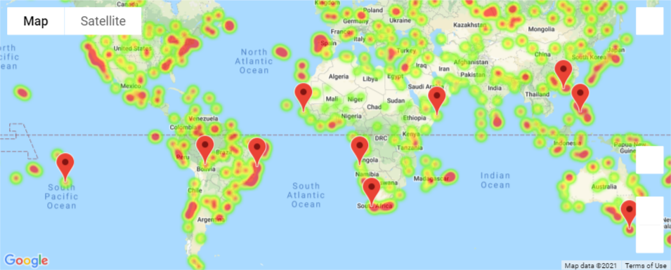
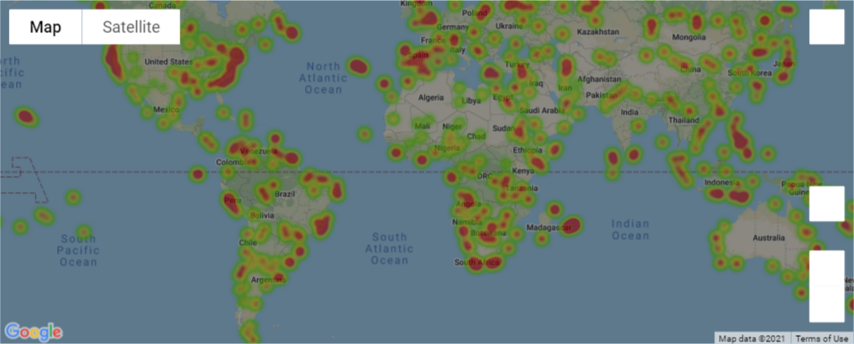

# Python API - What's the Weather Like?

## Background

Python requests, APIs, and JSON traversals to answer a fundamental question: "What's the weather like as we approach the equator?"

Now, we know what you may be thinking: _"Duh. It gets hotter..."_

But, if pressed, how would you **prove** it?

## Part I - WeatherPy

In this example, I created a Python script to visualize the weather of 500+ cities across the world of varying distance from the equator. To do this, I utilized a [simple Python library](https://pypi.python.org/pypi/citipy), the [OpenWeatherMap API](https://openweathermap.org/api), to create a representative model of weather across world cities.

Scatter plots were used to showcase the following relationships:

* Temperature (F) vs. Latitude
* Humidity (%) vs. Latitude
* Cloudiness (%) vs. Latitude
* Wind Speed (mph) vs. Latitude

A Linear regression was run on each relationship. The plots in the Northern Hemisphere was greater than or equal to 0 degrees latitude and Southern Hemisphere was less than 0 degrees latitude.

* Northern Hemisphere - Temperature (F) vs. Latitude
* Southern Hemisphere - Temperature (F) vs. Latitude
* Northern Hemisphere - Humidity (%) vs. Latitude
* Southern Hemisphere - Humidity (%) vs. Latitude
* Northern Hemisphere - Cloudiness (%) vs. Latitude
* Southern Hemisphere - Cloudiness (%) vs. Latitude
* Northern Hemisphere - Wind Speed (mph) vs. Latitude
* Southern Hemisphere - Wind Speed (mph) vs. Latitude

### Part II - VacationPy

Jupyter-gmaps and the Google Places API was used for this part of the assignment.

* **Note:** if you having trouble displaying the maps, try running `jupyter nbextension enable --py gmaps` in your environment and retry.

  

* The DataFrame was narrowed down to find the ideal weather conditions. For example:

  * A max temperature lower than 80 degrees but higher than 70.

  * Wind speed less than 10 mph.

  * Zero cloudiness.

  
